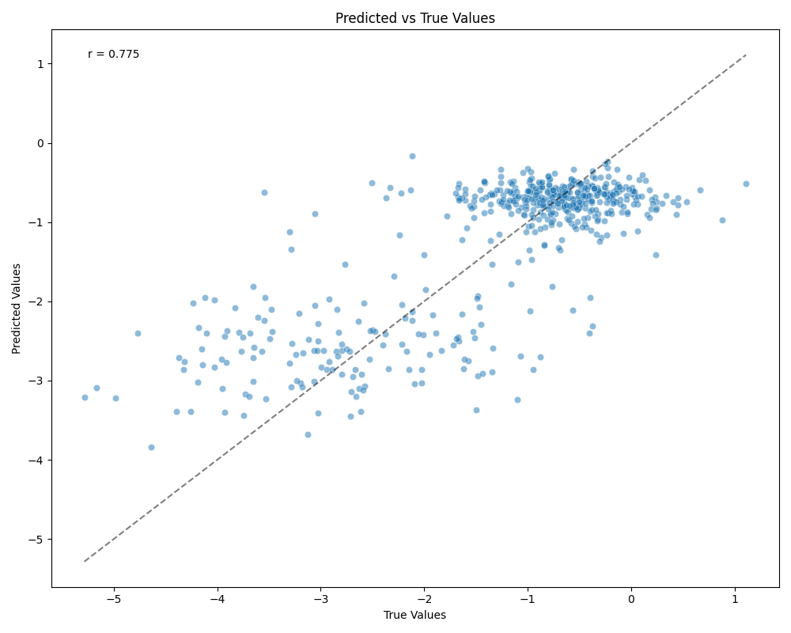
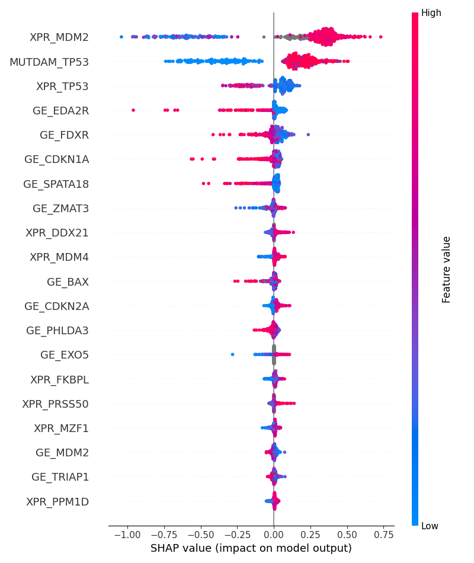

# Refract

Regression models for analysis of PRISM multiplexed cell-line datasets.

Nick Phillips (nphill22@stanford.edu)

## Overview 
| Predictive Modeling                                                                  | Feature Importance Analysis                                                     |
| :----------------------------------------------------------------------------------: | :-----------------------------------------------------------------------------: |
|  |  |


Refract is a workflow for predicting PRISM responses using mutivariable regression models. By interpreting these models, we can generate hypotheses of drug mechanism, revealing novel anti-cancer activity. The above example shows results for `AMG-232`, an MDM2 inhibitor. The responses are highly predictable, with a correlation of `0.78` between actual and estimated log fold change values. Feature analysis with SHAP reveals that cell lines with high dependency on MDM2 from CRISPR knockout screens and functional TP53 are sensitized to the drug. 

Results are visualized in a web application, hosted here: [www.refractdb.com](https://www.refractdb.com)

This package provides multiple machine learning approaches for drug response prediction using Nextflow workflows, including:
- XGBoost regression
- Linear (Lasso) regression  
- Random Forest regression
- Linear Quantile regression
- Neural Network quantile regression

All models are trained using nested cross-validation for hyperparameter optimization and evaluation.

## Setup

### Environment Setup
Create and activate a conda environment with all required dependencies:

```bash
conda env create -f environment.yml
conda activate refract
```

### System Requirements
- Python 3.x with conda/mamba
- Nextflow (for pipeline execution)
- At least 16GB RAM (configurable)
- Multi-core CPU recommended

## Input Data Formatting

### Response Data
Response files should be CSV format with the following structure:
- Each file represents responses for a specific drug/perturbation
- Required columns:
  - `depmap_id`: Cell line identifiers
  - `LFC`: Log-fold change in cell growth
  - `broad_id`: Unique identifier of perturbation
  - `name`: Common name of perturbation
  - `ccle_name`: Name of cell line


### Feature Data
Features should be provided as a pickle file containing a pandas DataFrame:
- Rows: Cell lines (indexed by `depmap_id`)
- Columns: Features, with column names formatted as `<feature_class>_<feature_name>`.
- File format: `.pkl` (pandas pickle)

## Commands to Run

### Main Pipeline Execution
Run the complete training pipeline using Nextflow:

```bash
nextflow run main.nf \
  --output_dir /path/to/output \
  --response_dir /path/to/response/files \
  --feature_path_pkl /path/to/features.pkl
```

### Development Mode
For testing with a subset of data:

```bash
nextflow run main.nf \
  --dev true \
  --output_dir /path/to/output \
  --response_dir /path/to/response/files \
  --feature_path_pkl /path/to/features.pkl
```

### SLURM Cluster Execution
For running on SLURM clusters:

```bash
nextflow run main.nf -profile slurm \
  --output_dir /path/to/output \
  --response_dir /path/to/response/files \
  --feature_path_pkl /path/to/features.pkl
```

### Individual Model Training
Train specific models directly:

```bash
# XGBoost model
python scripts/train_xgboost_model.py \
  --response_path response.csv \
  --feature_path features.pkl \
  --output_dir outputs/

# Linear model
python scripts/train_linear_model.py \
  --response_path response.csv \
  --feature_path features.pkl \
  --output_dir outputs/

# Random Forest model
python scripts/train_random_forest_model.py \
  --response_path response.csv \
  --feature_path features.pkl \
  --output_dir outputs/

# Quantile regression
python scripts/train_quantile_regression_model.py \
  --response_path response.csv \
  --feature_path features.pkl \
  --output_dir outputs/

# Neural Network quantile regression
python scripts/train_neural_network_quantile_model.py \
  --response_path response.csv \
  --feature_path features.pkl \
  --output_dir outputs/
```

## Expected Output

The pipeline generates several types of outputs in the specified output directory:

### File Structure
```
output_dir/
├── work/                    # Nextflow work directory
├── nextflow_reports/        # Pipeline reports
├── [drug_name]/            # Per-drug results
│   ├── xgboost_model
│   ├── linear_model
│   ├── random_forest
│   ├── quantile_regression
│   ├── train_splits
└── logs/                   # Execution logs
```

### Model Outputs
- Model predictions, basic plots, pickled models.
- Feature importance scores with SHAP
- Training, validation, and test metrics.


### Reports and Visualizations
- `nextflow_reports/`: Pipeline execution reports
  - `execution_report.html`: Detailed execution metrics
  - `timeline.html`: Timeline visualization
  - `pipeline_dag.html`: Pipeline workflow diagram
  - `trace.txt`: Execution trace log

### Data Splits
- `*.split.txt`: Train/validation/test split assignments
- `*.features.csv`: Selected features for each fold

## Configuration Options

### Main Parameters
- `--output_dir`: Output directory path (default: 'outputs')
- `--response_dir`: Directory containing response CSV files
- `--feature_path_pkl`: Path to pickled feature DataFrame
- `--dev`: Development mode - limits to 100 files (default: false)
- `--seed`: Random seed for reproducibility (default: 42)
- `--n_threads`: Number of threads per process (default: 8)

### Resource Configuration
Configure computational resources in `nextflow.config`:

```groovy
process {
    cpus = 4           # CPUs per process
    memory = '16GB'    # Memory per process
}

executor {
    cpus = 128         # Total CPUs available
    memory = '512GB'   # Total memory available
}
```

### Model-Specific Parameters
Each training script accepts additional parameters:
- `--n_features`: Number of top features to select (default: 50)
- `--n_splits`: Number of cross-validation splits (default: 10)
- `--train_val_split`: Train/validation split ratio (default: 0.8)

### Execution Profiles
- `standard` (default): Local execution with resource limits
- `slurm`: SLURM cluster execution with job queuing

### Advanced Configuration
Modify `conf/resources.config` for detailed resource allocation per process type.

## Example Usage

Complete workflow for drug response prediction:

```bash
# 1. Prepare your data
# - Response files: one CSV per drug in response_dir/
# - Feature file: single pickle file with cell line features

# 2. Run the pipeline
nextflow run main.nf \
  --output_dir results/ \
  --response_dir data/responses/ \
  --feature_path_pkl data/features.pkl
```
